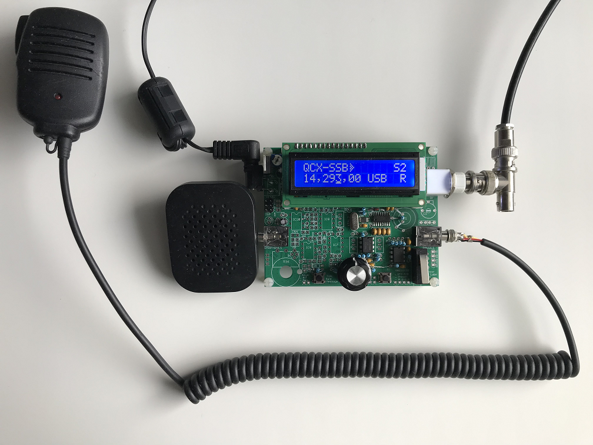
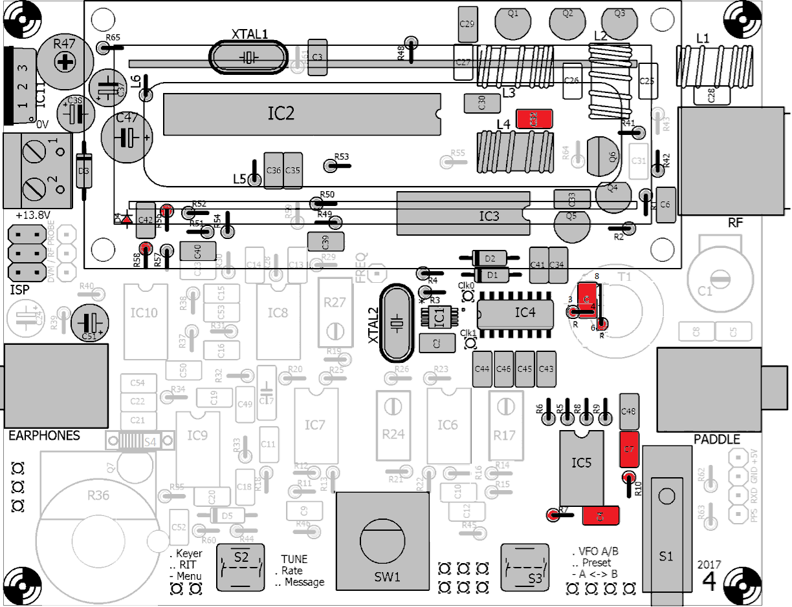
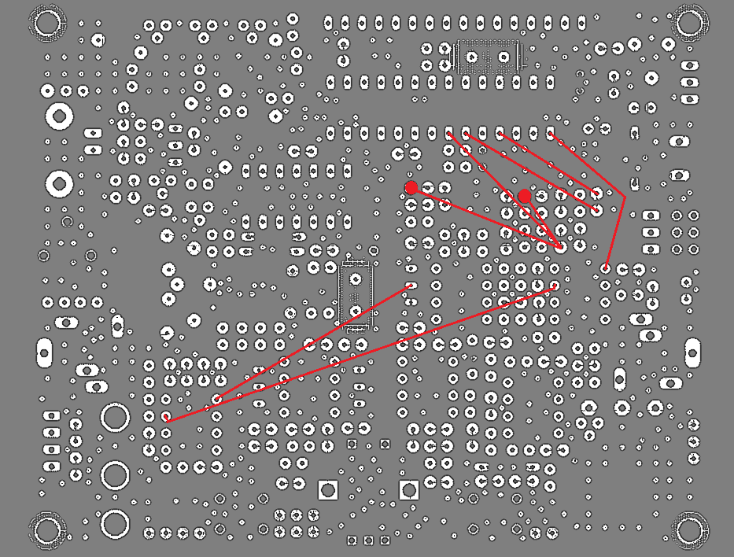
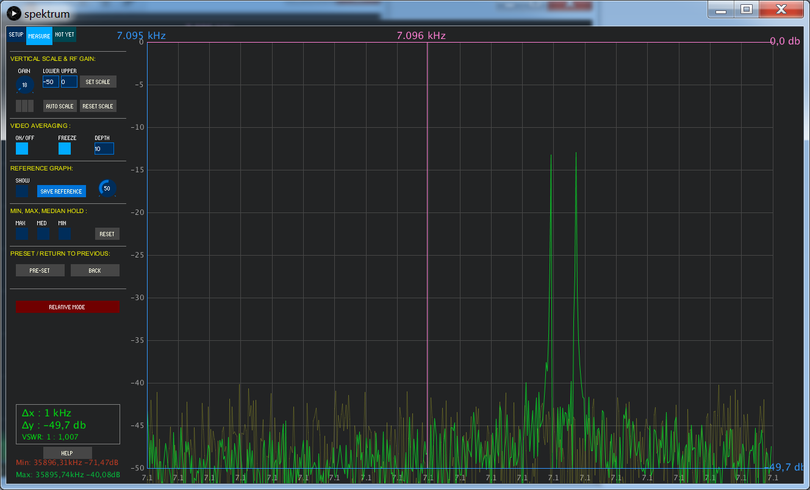

# **ⓆⒸⓍ-ⓈⓈⒷ**

# QCX-SSB: SSB (+ SDR) with your QCX transceiver
This is a simple and experimental modification that transforms a [QCX] into a (Class-E driven) SSB transceiver. It can be used to make QRP SSB contacts, or (in combination with a PC) used for the digital modes such as FT8. It can be fully-continuous tuned through bands 160m-10m in the LSB/USB-modes with a 2400Hz bandwidth has up to 5W PEP SSB output and features a software-based full Break-In VOX for fast RX/TX switching in voice and digital operations.

The SSB transmit and receiver stages are implemented completely in a digital and software-based manner. At transmit the ATMEGA328P samples the input-audio and reconstructing a SSB-signal by controlling the SI5351 PLL phase (through tiny frequency changes over 800kbit/s I2C) and controlling the PA Power (through PWM on the key-shaping circuit). In this way a highly power-efficient class-E driven SSB-signal can be realized; a PWM driven class-E design keeps the SSB transceiver simple, tiny, cool, power-efficient and low-cost (ie. no need for power-inefficient and complex linear amplifier with bulky heat-sink as often is seen in SSB transceivers). At receive the ATMEGA328P over-samples the I/Q at 62.5kHz, implements a down-sampling phasing receiver in the digital domain via Hilbert transformers and digital filters, and sends the resulting signal via PWM shaping to the headphone/speaker output.

An Open Source Arduino sketch is used as the basis for the firmware, the hardware modification bypasses the QCX CW filter and adds a microphone input in-place of the DVM-circuit; the mod is easy to apply and consist of four wire and four component changes and after applying the transceiver remains compatible with the original QCX (CW) firmware.

This experiment is created to try out what can be done with very minimal and simplified hardware; a simple ATMEGA processor, a QCX and a software-based SSB processing approach. Feel free to experiment with this sketch, let me know your thoughts or contribute here: https://github.com/threeme3/QCX-SSB  There is a forum discussion on the topic here: [QRPLabs Forum]

73, Guido
pe1nnz@amsat.org

## List of features:
- Modification into a **simple, fun and versatile QRP CW/SSB HF transceiver** with some interesting DSP and SDR techniques; it compromises a bit on performance so not a high-performance transceiver. 
- **[EER]/[Polar-transmitter] Class-E** driven SSB transmit-stage
- Approximately **5W PEP SSB output** (depending on supply voltage, amplitude-PA voltage regulated through PWM with 48dB dynamic range)
- Supports **USB and LSB** modes up to **2400 Hz bandwidth** (receiver and transmitter 400..2330Hz)
- Two-tone third-order intermodulation distortion **(IMD3) of -33dBc** (-16dBc for constant-envelope) and **carrier/side-band rejection better than -45dBc** (two-tone)
- Receiver unwanted side-band **rejection up to -20dB**
- Continuously tunable through bands **80m-10m** (anything between 20kHz-99MHz is tunable but with degraded or loss in performance)
- **Multiband** support [note 1](#note1)
- Software-based **VOX** that can be used as **fast Full Break-In** (QSK operation) or assist in RX/TX switching for operating digital modes (no CAT or PTT interface required)
- **Simple easy to install modification** with only **6 component changes and 4 wires** to implement a basic SSB transceiver
- Firmware is **open source** through an Arduino Sketch, it allows experimentation, new features can be easily added, contributions can be shared via Github repository QCX-SSB
- Completely **digital and software-based** SSB transmit-stage (**no additional circuitry needed**, except for the audio-in circuit)
- **ATMEGA328P signal processing:** samples audio-input and reconstruct a SSB-signal by controlling the _phase of the SI5351 PLL_ (through tiny frequency changes over 800kbits/s I2C) and the _amplitude of the PA_ (through PWM of the PA key-shaping circuit).
- **Lean and low-cost SSB transceiver design**: because of the EER/Polar-transmitter class-E stage it is **highly power-efficient** (no bulky heatsinks required), and has a **simple design** (no complex balanced linear power amplifier required)
- An **pre-distorion** algorithm that cancels out the amplitude errors of non-linearities in the PA voltage regulated PWM supply; a lookup table is used that can be calibrated with an internal PA amplitude measurement
- Possibility to extend the QCX analog phasing stage with a **DSP stage**
- Could replace the QCX analog phasing stage completely with a **digital SDR receiver stage**, taking away the need for the manual side-band rejection adjustment procedure and delivering DSP features such as the joy of having a **AGC, adjustable CW/SSB filters**.
- A theoretical **digital receiver dynamic range of 83dB** at 2.4kHz BW.  (1 dB) Compression point (at -126dBm sensitivity): -44dBm/1mV (for in-band signal); -4dBm/160mV (for signal at 15kHz offset); 19dBm/2V (for signal at 100kHz offset or more).
- Switchable attenuator steps: 0dB, -13dB, -20dB, -33dB
- SDR implementation **simplifies** the receiver heaviliy and **shaves off roughly 30% of the components** from the original QCX design while adding new and improving existing features. On a new QCX build: 46 components less to be installed, 8 component design changes, 9 additional wires.
- Can be used as alternate firmware on an unmodified QCX.

## Revision History:
| Rev.  | Date       | Features                                                            |
| ----- | ---------- | ------------------------------------------------------------------- |
| R1.02 | 2019-09-01 | Embedded SDR receiver, CW decoder, DSP filters, AGC. |
| R1.01 | 2019-05-05 | Q6 now digitally switched (remove C31) - improving stability and IMD. Improved signal processing, audio quality, increased bandwidth, cosmetic changes and reduced RF feedback, reduced s-meter RFI, S-meter readings, self-test on startup. Receiver I/Q calibration, (experimental) amplitude pre-distortion and calibration. |
| R1.00 | 2019-01-29 | Initial release of SSB transceiver prototype. |

## Schematic:
Below the schematic after the modification is applied, components are left out and changed (marked in red) (link to [original schematic]):

## Installation:
To make the modification, you need to remove and change components, install wires, upload the new firmware and add a microphone. Before starting, familiarizing yourself with [note 4](#note4), then apply the following changes in component value and type, and wire the following pads on the backside PCB:

1. To implement the SDR receiver: R11,12,17,24,27,29,59,IC10 (remove); IC7-9,R13,R18-20,R25,R28-40,R60,C9,C11,C13-24,C52-53,D5,Q7 (omit on new builds); C10 (.1uF); R16,23 (120k); wire IC10(pin7) to IC6(pin7); wire R27(pin2) to IC6(pin1); wire IC2(pin15) to IC10(pin1); disconnect R50-5V and R52-5V and both wire to R57-DVM(pin3); disconnect R21-IC6(pin7) and R22-IC6(pin7) and both wire to R7-IC5(pin1).
2. To implement the SSB transmitter: D4,R21,R56 (10k); R58 (.22uF); C32 (10uF); C31 (remove); wire IC2-pin21 to R57-DVM(pin3); wire IC2(pin20) to DVM(pin2); wire IC2(pin18) to junction D4-C42-R58;
3. Connect an electret microphone pins (+) to tip and (-) to sleeve of paddle-jack; PTT-switch pins to ring and sleeve (see [X1M-mic]).
4. Install an [Arduino] environment and upload this [QCX-SSB Sketch] to an Arduino Uno board that contains a new ATMEGA328P chip, subsequently move it to IC2. Alternatively, while the ATMEGA328P chip is placed in IC2, the firmware can be uploaded via the ISP header (see [note 2](#note2)).

Below the layout with components marked in red that needs to be changed; gray components must be installed and blank components may be omitted on new builds:

Below the wiring that needs to be applied on the bottom PCB; a circle indicates that the component pin is disconnected from the pad and connected to another pad via a wire:

## Operation:
Currently, the following functions have been assigned to the buttons:

| Button              | Function                                                |
| ------------------- | ------------------------------------------------------- |
| LEFT single-press   | Select menu-item, setting or goes back                  |
| LEFT double-press   |                                                         |
| LEFT long-press     |                                                         |
| LEFT press + turn   | Quick menu                                              |
| CENTER single-press | Select (smaller) frequency step                         |
| CENTER double-press | Select Band                                             |
| CENTER long-press   | Select (larger) frequency step                          |
| CENTER turn         | Tune frequency                                          |
| CENTER press + turn | Volume & Power-off                                      |
| RIGHT single-press  | LSB/USB/CW-mode                                         | 
| RIGHT double-press  | Filter Bandwidth                                        |
| RIGHT long-press    | VOX mode (for full-break-in or digital modes)           |
| RIGHT press + turn  |                                                         |
| KEY                 | Push-to-talk (SSB) / Straight-key (CW)                  |

Operating Instructions:

Tuning can be done by turning the rotary encoder. Its step size can be decreased or increased by a short or long press. A change of band can be done with a double press. The mode of operation is altered with a short press on the right button; this can be combined with changing S4 to change between wide-band (SSB) and small-band operation operation.

For SSB voice operation, adjust the amplitude drive by double-pressing right button to a level where voice peaks providing maximum power output (not more than that); this provides an acceptable IMD with good intelligability for local and normal distant operations. In cases where your signal is too weak, set the drive level to 8 to increase the average power output by using a constant amplitude-envelope; in some cases this might be just enough to put your signal above the noise-floor and make yourselve heard; note that this operation degrades the IMD considerably, but since this does not impact the intelligability and since these inter-modulation products are anyway below the noise-floor (and BW limited) they are not in the way, ie. they are not observable by the other station. For long duration QSOs on a specific frequency you can stop holding the PTT by enter (or leave) VOX mode with a long press on right button.

For FT8 (and any other digital) operation, select one of the pre-programmed FT8 bands by double press the rotary encoder, connect the headphone jack to sound card microphone jack, sound card speaker jack to microphone jack, and give a long press on left button to enter VOX mode. Adjust the sound card speaker volume to a minimum and start your favorite FT8 application (JTDX for instance).

To experiment with amplitude pre-distortion algorithm, double-press left button to train the PA amplitude characteristic. This sweeps the amplitude from maximum PWM to minimum PWM and measures the PA response through an internal receiver loopback and stores the values into volatile memory. Once trained, set the appropriate amplitude drive level for voice input. Pre-distorted amplitude response can be measured with a storage spectrum-analyser and a long-press of left button; it will sweep the pre-distorted amplitude from 0 to 100% in 255 steps, where each step has a 10Hz frequency offset.

The receiver side-band rejection can be measured and adjusted through a left single press button. To do so, turn down the volume, connect a dummy-load and enable the original CW-filter. After pressing the button, the I-Q balance, Lo Phase and High phase is measured; adjust R27, R24, R17 subsequently to its minimum side-band rejection value in dB.

On startup, the transceiver is performing a self-test. It is checking the supply and bias voltages, I2C communications and algorithmic performance. In case of deviations, the display will report an error during startup.

## Technical Description:
The principle of operation of this project is based on the following video-fragment: [Opzij] (in Dutch; [lyrics])

For SSB reception, the QCX analog phasing receiver stage is replaced with a digital SDR stage; this means that the phase shifting op-amp IC6 is changed into a regular amplifier and whereby the individual I and Q outputs are directly fed into the ATMEGA328P ADC inputs for signal processing. The ATMEGA328P will over-sample the ADC input at a 32kHz sample-rate and perform a phase-shift by means of a Hilbert-transform and summing the result to obtain side-band rejection; it will also perform CW or SSB filtering and provide an AGC function. Since the phase-shifting network and analog CW filter are no used, about 30% of the components can be left out; by combining the function of IC7B into IC6A another op-amp can be saved. The ADC inputs are low-pass filtered (-40dB/decade roll-off at 1.5kHz cut-off) to prevent aliasing and input are biased with a 1.1V analog reference voltage to obtain additional sensitivity and dynamic range. With the 10-bit ADCs and a 4x over-sampling rate, a theoretical dynamic range of 72dB can be obtained in 2.4kHz SSB bandwidth. LSB/USB mode switching is done by changing the 90 degree phase shift on the CLK1/CLK2 signals of the SI5351 PLL.

For SSB transmission the QCX DVM-circuitry is changed and used as an audio-input circuit. An electret-microphone (with PTT switch) is added to the Paddle jack connecting the DVM-circuitry, whereby the DOT input acts as the PTT and the DASH input acts as the audio-input. The electret microphone is biased with 5V through a 10K resistor. A 10nF blocking capacitor prevents RF leakage into the circuit. The audio is fed into ADC2 input of the ATMEGA328P microprocessor through a 220nF decoupling capacitor. The ADC2 input is biased at 0.55V via a divider network of 10K to a 1.1V analog reference voltage, with 10-bits ADC resolution this means the microphone-input sensitivity is about 1mV (1.1V/1024) which is just sufficient to process unamplified speech.

A new QCX-SSB firmware is uploaded to the ATMEGA328P, and facilitates a [digital SSB generation technique] in a completely software-based manner. A DSP algorithm samples the ADC2 audio-input at a rate of 4800 samples/s, performs a Hilbert transformation and determines the phase and amplitude of the complex-signal; the phase-changes are restricted[note 3](#note3) and transformed into either positive (for USB) or negative (for LSB) phase changes which in turn transformed into temporary frequency changes which are sent 4800 times per second over 800kbit/s I2C towards the SI5351 PLL. This result in phase changes on the SSB carrier signal and delivers a SSB-signal with a bandwidth of 2400 Hz whereby spurious in the opposite side-band components is attenuated. 

The amplitude of the complex-signal controls the supply-voltage of the PA, and thus the envelope of the SSB-signal. The key-shaping circuit is controlled with a 32kHz PWM signal, which can control the PA voltage from 0 to about 12V in 256 steps, providing a dynamic range of (log2(256) * 6 =) 48dB in the SSB signal. C31 is removed to ensure that Q6 is operating as a digital switch, this improves the efficiency, thermal stability, linearity, dynamic range and response-time. Though the amplitude information is not mandatory to make a SSB signal intelligable, adding amplitude information improves quality. The complex-amplitude is also used in VOX-mode to determine when RX and TX transitions are supposed to be made.

The IMD performance is related dependent on the quality of the system: the linearity (accuracy) of the amplitude and phase response and the precision (dynamic range) of these quantities. Especially the DSP bit-width, the precision used in the DSP algorithms, the PWM and key-shaping circuit that supplies the PA and the PA phase response are critical. Decreasing (or removing) C32 improves the IMD characteristics but at the cost of an increase of PWM products around the carrier.

## Results
Here is a [sample] me calling CQ on 40m with my QCX-SSB at 5W and received back by the Hack Green websdr about 400km away.

Several OMs reported a successful QCX-SSB modification and were able to make SSB QRP DX contacts over thousands of kilometers on the 20m and 40m bands. During CQ WW contest I was able to make 34 random QSOs on 40m with 5W and an inverted-V over the house in just a few hours with CN3A as my furthest contact, I could observe the benefits of using SSB with constant-envelope in cases where my signal was weak; for FT8 a Raspberry Pi 3B+ with JTDX was used to make FT8 contacts all the way up to NA.

Measurements:
The following performance measurements were made with QCX-SSB R1.01, a modified RTL-SDR, Spektrum-SVmod-v0.19, Sweex 5.0 USB Audio device and Audicity player. It is recognized that this measurement setup has its own limitations, hence the dynamic range of the measurements is somewhat limited by the RTL-SDR as this device goes easily into overload. Measurements were made with the following setttings: USB modulation, no pre-distortion, two-tone input 1000Hz/1200Hz where audio level is set just before the point where compression starts. Results:
- Intermodulation distortion products (two-tone; SSB with varying  envelope) IMD3, IMD5, IMD7: respectively -33dBc; -36dBc; -39dBc
- Intermodulation distortion products (two-tone; SSB with constant envelope) IMD3, IMD5, IMD7: respectively -16dBc; -16dBc; -19dBc
- Opposite side-band rejection (two-tone): better than -45dBc
- Carrier rejection (two-tone): better than -45dBc
- Wide-band spurious (two-tone): better than -45dBc
- 3dB bandwidth (sweep): 400..2330Hz

### Notes:
1. <a name="note1"/>To support multi-band operation, the RX BPF can be omitted (C1,C5,C8, secondary 3 of T1). To improve RX sensitivity on higher bands, T1 and R64 should be removed and on the original wire-endings of T1 (see [original Assembly instruction] chapter 3.56 for PC Board pattern) the following components should be installed: resistor 1K over 6-8 and 3-4; capacitor 10nF over 4-8. A switchable LPF-bank could replace the existing LPF C25-28,L1-L3, or a wire may bypass if external LPFs are present; the matching network C30,L4 should be set to 30pF and 1uH (16 turns). A switchable filter-bank could potentialy be controlled via I2C I/O port.
2. <a name="note2"/>The QCX-SSB firmware can be uploaded to ATMEGA328P chip placed in the QCX via ISP programming on an Arduino Uno board. To do so, istall an [Arduino] environment, connect an Arduino Uno board to PC, upload this [ArduinoISP] sketch to Uno, install a new ATMEGA328P chip in QCX, connect Arduino Uno to QCX via [ISP jumper] wiring, power on QCX, in Arduino select "Tools > Programmer > Arduino as ISP", select "Tools > Board > Arduino/Genuino Uno", select "Tools > Port > /dev/ttyUSB0 or ttyACM0", select "Tools > Burn Bootloader", upload [QCX-SSB Sketch] by opening and selecting "Sketch > Upload Using Programmer". Once upload succeeds the LCD should display "QCX-SSB". Make sure that the Microphone is not connected during programming.
Alternatively a firmware hex file can be uploaded with avrdude: avrdude -c avrisp -b 19200 -P /dev/ttyUSB0 -p m328p -F -U flash:w:QCX-SSB.ino.with_bootloader.standard.hex
Suitable fuse settings are: avrdude -c avrisp -b 19200 -P /dev/ttyUSB0 -p m328p -U efuse:w:0xfd:m -U hfuse:w:0xd1:m -U lfuse:w:0xF7:m
3. <a name="note3"/>The occupied SSB bandwidth can be further reduced by restricting the maximum phase change (set MAX_DP to half a unit-circle _UA/2 (equivalent to 180 degrees)). The sensitivity of the VOX switching can be set with parameter VOX_THRESHOLD. Audio-input can be attenuated by increasing parameter MIC_ATTEN (6dB per step).
4. <a name="note4"/>To implement the SDR stage, the 17 component changes of installation step 1 are easiest to be implemented on a newly to be build QCX. Alternatively, on an already built QCX it is easier to bypass the CW filter (see [note 4](#note4)), this maintains the hardware compatibility with the original QCX firmware. Optionally this can be extended with a Arduino based DSP filter stage (see [note 5](#note5)).
5. <a name="note5"/>To implement SSB receiver via CW filter bypass: disconnect C21(+) and wire to common of a SPDT switch; wire R27(pin2) and IC9(pin1) both to each throw of SPDT switch. (see here the corresponding [schematic](https://raw.githubusercontent.com/threeme3/QCX-SSB/26c4e97a034d367e1325c5587a56a7c2a43c69f3/schematic.png) and [layout](https://raw.githubusercontent.com/threeme3/QCX-SSB/26c4e97a034d367e1325c5587a56a7c2a43c69f3/layout.png)).
6. <a name="note6"/>To implement SSB receiver with DSP back end: disconnect C21(+) and wire to R27(pin2); R59 (remove); disconnect C51(+) and wire to IC2(pin15). (schematic and layout similar as analog back end, with SIDETONE output disconnected from audio stage and directly connected to headphones).

### Credits:
[QCX] (QRP Labs CW Xcvr) is a kit designed by _Hans Summers (G0UPL)_, originally built for RSGB's YOTA summer camp 2017, a high performance, image rejecting DC transceiver; basically a simplified implementation of the [NorCal 2030] by _Dan Tayloe (N7VE)_ designed in 2004 combined with a [Hi-Per-Mite] Active Audio CW Filter by _David Cripe (NMØS)_, [Low Pass Filters] from _Ed (W3NQN)_ 1983 Articles, a key-shaping circuit by _Donald Huff (W6JL)_, a BS170 switched [CMOS driven MOSFET PA] stage like the famous [ATS] designs by _Steven Weber (KD1JV)_ (originating from the [Power MOSFET revolution] in the mid 70s), and combined with popular components such as Atmel [ATMEGA328P] microprocessor, a Hitachi [HD44780] LCD display and a Silicon Labs [SI5351] Clock Generator (and using a [phase shift in the SI5351 clocks]). The [QCX-SSB] modification and its Arduino [QCX-SSB Sketch] is designed by _Guido (PE1NNZ)_; the software-based SSB transmit stage is a derivate of earlier experiments with a [digital SSB generation technique] on a Raspberry Pi in 2013 and is basically a kind of [EER] implemented in software.

### References
- VERON association interviewed me in the [PI4AA June issue] about this project (in Dutch, starting at timestamp 15:50).
- Rüdiger Möller, HPSDR presentation by [DJ1MR], 2018. Transmitter architectures for high efficiency amplification

[original schematic]: https://qrp-labs.com/images/qcx/HiRes.png

[QCX-SSB]: https://github.com/threeme3/QCX-SSB

[ArduinoISP]: https://raw.githubusercontent.com/adafruit/ArduinoISP/master/ArduinoISP.ino

[ISP jumper]: https://qrp-labs.com/images/qcx/HowToUpdateTheFirmwareOnTheQCXusingAnArduinoUNOandAVRDUDESS.pdf

[Arduino]: https://www.arduino.cc/en/main/software#download

[digital SSB generation technique]: http://pe1nnz.nl.eu.org/2013/05/direct-ssb-generation-on-pll.html

[QCX]: https://qrp-labs.com/qcx.html

[QCX-SSB Sketch]: QCX-SSB.ino

[X1M-mic]: https://vignette.wikia.nocookie.net/x1m/images/f/f1/X1M_mic_pinout_diagram.jpg/revision/latest?cb=20131028014710

[QRPLabs Forum]: https://groups.io/g/QRPLabs/topic/29572792

[Norcal 2030]: http://www.norcalqrp.org/nc2030.htm

[Hi-Per-Mite]: http://www.4sqrp.com/hipermite.php

[Low Pass Filters]: http://www.gqrp.com/harmonic_filters.pdf

[CMOS driven MOSFET PA]: http://www.ka7oei.com/mpm_class_e.html

[Power MOSFET revolution]: https://archive.org/details/VMOSSiliconixOCR/page/n17

[ATS]: https://groups.yahoo.com/neo/groups/AT_Sprint/files/AT%20Sprint%20/

[Intelligibility]: https://g8jnj.webs.com/speechintelligibility.htm

[SI5351]: https://www.silabs.com/documents/public/application-notes/AN619.pdf

[ATMEGA328P]: http://ww1.microchip.com/downloads/en/DeviceDoc/ATmega48A-PA-88A-PA-168A-PA-328-P-DS-DS40002061A.pdf

[HD44780]: https://www.sparkfun.com/datasheets/LCD/HD44780.pdf

[sample]: https://youtu.be/-QfMQulk0eA

[PI4AA June issue]: https://cdn.veron.nl/pi4aa/2019/PI4AA_Uitzending20190607.mp3

[EER]: https://core.ac.uk/download/pdf/148657773.pdf

[MBF]: https://www.arrl.org/files/file/QEX_Next_Issue/Mar-Apr2017/MBF.pdf

[Polar-transmitter]: https://sigarra.up.pt/fcup/pt/pub_geral.show_file?pi_doc_id=25850

[DJ1MR]: https://www.youtube.com/watch?v=A6ohr98ikeA

[RX3DPK]: https://www.facebook.com/photo.php?fbid=2382353591830446&set=pcb.2382353628497109&type=3&theater

[Opzij]: https://youtu.be/uN706PiFLm0

[lyrics]: https://www.google.com/search?q=lyrics+opzij

[phase shift in the SI5351 clocks]: https://www.silabs.com/community/timing/forum.topic.html/difficulty_settingp-LchG

[original Assembly instruction]: https://www.qrp-labs.com/images/qcx/assembly_A4_Rev_4b.pdf

[Arduino PWM]: http://interface.khm.de/index.php/lab/interfaces-advanced/arduino-dds-sinewave-generator/

